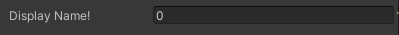
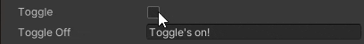
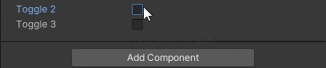

#  Unity Editor Attributes
A collection of dynamic property drawer attributes for use in the Unity Editor.
## Features

### ReadOnly Attribute
Attribute that allows a field to be displayed in-editor but not edited.


``` C#
    [ReadOnly]
    public string readOnly = "You can't edit this!";
```

### Rename Attribute
Changes the display name of the field in-editor.


``` C#
    [Rename("Display Name!")]
    public int hiddenName = 0;
```

### ConditionalHide Attribute
Dynamically hides and shows fields in-editor based on the state of the object.

Here's a simple example where two fields are hidden/shown based on the state of a tickbox:



``` C#
    public bool toggle = true;

    [ConditionalHide("toggle", true)]
    public string toggleOn = "Toggle is on!";

    [ConditionalHide("toggle", false)]
    public string toggleOff = "Toggle is off!";
```

And a more complex example with multiple tickboxes are taken into account:



``` C#
    public bool toggle2 = true;
    public bool toggle3 = true;

    [ConditionalHide(new string[] { "toggle2", "toggle3" }, new object[] { true, true },
    ConditionalHideAttribute.FoldBehavior.Or)]
    public string OneActive = "One toggle active!";

    [ConditionalHide(new string[] { "toggle2", "toggle3" }, new object[] { true, true },
    ConditionalHideAttribute.FoldBehavior.And)]
    public string BothActive = "Both toggles active!";
```

### PropertyDrawerFinder
A utility class that can retrieve property drawers for types and fields. Useful for developing your own complex property drawers.

## Installation
[Download](https://github.com/ollyisonit/UnityEditorAttributes/releases/latest) or clone this repository and put it in the Assets folder of your Unity project.
